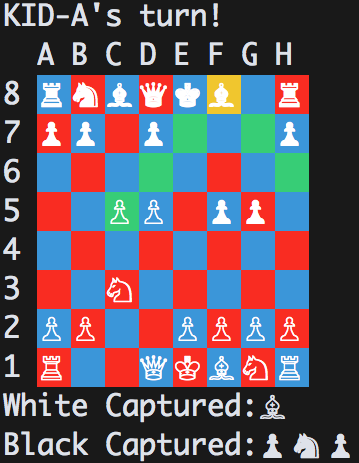

# Chess

A Ruby implementation with a command line interface.

## How to Play

###Getting Set Up
You will need Ruby installed on your system to play this game. Download the code and using the command line, navigate to the main directory. Next, run the 'chess.rb' file with the command 'ruby chess.rb'. This will prompt you to load a saved game or choose the type of game you'd like to play.

###Playing the Game
You can move your cursor with the arrow keys (▲ ▼ ◀ ▶). When you hover over a piece, all of the squares where that piece can move will be highlighted in green To select a piece to move, hit ENTER. Then, select the square you would like to move to and hit SPACE.

## Technologies

The game is written with Ruby. It requires two gems - colorize and io-console.

## Implementation Details

### Game Saving
Used YAML to allow the saving of game states. Users now have the option to load previous games on initialize.

### Modules
Used multiple modules (moveable, slideable, steppable) to keep the code as DRY as possible. 

### AI

## TODO
* working on my knight moves
* implement poly tree node for AI
